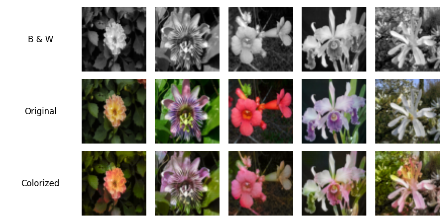

# Image Colorization using U-Net and GAN

## Overview
This project implements an advanced image colorization system that transforms grayscale images into naturally colorized outputs using deep learning. By combining U-Net architecture with Generative Adversarial Networks (GANs), our system learns to predict plausible colors for black and white images.

## Setup
To install all required dependencies:
```
pip install -r requirements.txt
```

## Data
The model trains on the Flowers102 dataset, which provides high-quality flower images with diverse colors and patterns. While the dataset includes class labels, we do not use them since our colorization process is independent of flower species.

We chose to work in the CIELAB color space over RGB for three key advantages: it separates brightness (L\*) from color (a\* and b\*), reduces the prediction space from three channels to two, and provides perceptually uniform color representation. This makes the training process more efficient and produces better results.

## Model Architecture

### Generator (U-Net)
The generator implements a U-Net architecture with skip connections between encoder and decoder paths. These connections preserve spatial details by combining low-level features with high-level abstractions. The network receives grayscale input (L channel) and outputs color predictions (\*a\*b channels).

### Discriminator (PatchGAN)
The discriminator uses a PatchGAN design that classifies N×N patches as real or fake, rather than evaluating the entire image at once. This patch-based approach improves the quality of local textures and color transitions. The discriminator compares the generated colorization against real color images during training.

## Results

<p align="center">

</p>

## References

I. J. Goodfellow et al., (2014). [*Generative Adversarial Networks*](https://arxiv.org/pdf/1406.2661)

O. Ronneberger, P. Fischer, & T. Brox, (2015). [*U-Net: Convolutional Networks for Biomedical Image Segmentation.*](https://arxiv.org/abs/1505.04597)


P. Isola, J.-Y. Zhu, T. Zhou, & A. A. Efros, (2016). [*Image-to-Image Translation with Conditional Adversarial Networks.*](https://arxiv.org/abs/1611.07004)


R. Zhang, P. Isola, & A. A. Efros, (2016). [*Colorful Image Colorization.*](https://arxiv.org/abs/1603.08511)
